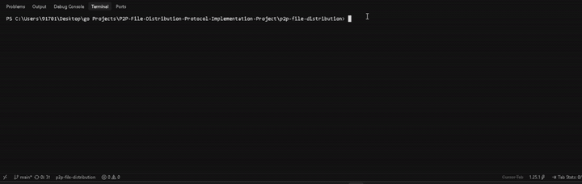

# p2p-file-distribution

A BitTorrent v1 client written in Go from the protocol spec, with no
third-party runtime dependencies. Bencode, the tracker protocol, the
peer wire protocol, concurrent piece download, and disk I/O are all
built by hand rather than imported.

[](https://github.com/asmanya/p2p-file-distribution/actions/workflows/ci.yml)
[](go.mod)
[](LICENSE)



## Quick start

```bash
git clone https://github.com/asmanya/p2p-file-distribution.git
cd p2p-file-distribution
go build -o p2pget ./cmd/p2pget
```

```bash
./p2pget -torrent path/to/file.torrent -out ./downloads
```

Add `-seed` to keep seeding once the download finishes. `-h` lists every
flag (max peers, listen port, log level).

## Features

- **Concurrent, rarest-first downloading.** Connects to peers in
  parallel and picks the next piece by rarity across the whole swarm,
  not per connection.
- **SHA-1 verified, disk-streamed.** Every piece is hash-checked
  before it's trusted, written straight to disk at constant memory
  regardless of file size.
- **Endgame mode.** The last few pieces are requested from every peer
  that has them; whichever finishes first cancels the rest.
- **Resume.** An interrupted download picks up where it left off
  instead of starting over.
- **Live progress display.** Percent, speed, peers, and ETA update in
  place, colorized, without scrolling the terminal.
- **Seeding.** Once every piece is in, the client keeps running and
  serves other peers - incoming and outgoing connections share the
  same connection loop.
- **Tit-for-tat choking.** Decides who gets served, with a rotating
  optimistic slot so a new peer still gets a chance to start
  reciprocating.
- **Graceful shutdown.** A signal stops new work and gives in-flight
  pieces a short window to land on disk before closing every
  connection; a second signal forces an immediate exit.
- **Verified against a real client, not just itself.** Transmission
  downloaded a complete file from this client, and this client
  downloaded a complete file from Transmission, checksums matching
  both ways. See [Testing](#testing).

Real numbers from actual downloads are in [Performance](#performance).

**Not implemented:** BitTorrent v2 / SHA-256 piece hashes, multi-file
torrents, magnet links (which need DHT-based peer discovery instead of
a tracker), and multi-torrent sessions in one process. See
[Known limitations](#known-limitations).

## Architecture

Seven packages. Dependencies only point down the list:

```
7 cmd/p2pget          CLI. Flags + wiring only. No logic.
6 internal/download   Orchestration. Only package with full system visibility.
5 internal/storage    Disk I/O, resume verification.
4 internal/tracker    HTTP announce. Does not talk to peers.
3 internal/peer       Wire protocol + connection lifecycle.
2 internal/piece      Geometry + SHA-1 verification. Pure, no I/O.
2 internal/metainfo   .torrent parsing + info hash. No network, no disk writes.
1 internal/bencode    Serialization. Zero knowledge of torrents.
```

`bencode` has never heard of a torrent. `peer` speaks the wire protocol
but has no say in which piece gets requested next. `download` is the
only package that sees the whole system. Per-package reasoning and who
owns what shared state live in
[`docs/architecture.md`](docs/architecture.md).

## Design decisions

A few decisions worth calling out here; the rest are in the
architecture doc.

- **Zero-reflection bencode.** No struct tags, no library. A sealed
  `Value` interface with four concrete types keeps every type switch
  exhaustive by construction.
- **Guard before allocate.** Every untrusted size - a bencode string
  length, a tracker response body, a peer message - is checked before
  it costs memory, not after.
- **Cross-checked info hash.** Computed two independent ways so
  correctness doesn't rest on a single code path.
- **Fault-injected wire format.** Serialize/parse are pure functions,
  tested against exact byte fixtures and over `net.Pipe` against
  hostile input - bad handshakes, split reads, malicious lengths.
- **Single-goroutine coordinator.** Piece status, swarm rarity, the
  peer registry, and every in-flight assignment live in one place,
  reached only through channels. No mutex, because nothing outside
  that goroutine ever touches the state.
- **Rarest-first selection.** For swarm health, not raw speed:
  replicating the pieces only one or two peers hold is what stops a
  torrent from losing data if its last holder disconnects.
- **Timeout-bound assignments.** Duplicate requests for a piece are
  prevented by the piece's own state, and every assignment times out,
  so a half-open connection can't hold a piece hostage forever.
- **Endgame mode.** Duplicate prevention turns off near the end on
  purpose - the last few pieces go to every peer that has them, first
  to finish wins, closing the "stuck on one slow peer" tail.
- **Policy/mechanics separation.** Piece selection is tested by
  feeding it events directly - no network, no timing, no fake peers,
  the whole suite runs in milliseconds.
- **Panic recovery per worker.** Full stack trace plus a running
  counter, so one bad peer can't take the whole download down, and
  the failure still doesn't go unnoticed.
- **Honest about SHA-1.** Used because the BitTorrent v1 spec requires
  it, not because it's secure - it's broken, and that's stated
  outright instead of left for a reviewer to catch.
- **Lock-free positional writes.** `WriteAt` per piece; non-overlapping
  byte ranges are safe to write concurrently without coordination.
- **Metadata-free resume.** Re-hashes whatever's on disk against the
  torrent's expected hashes on startup - a match means done, anything
  else gets re-downloaded. Nothing but the file itself is trusted.
- **Shared connection loop.** Seeding reuses the exact same loop as
  downloading - a TCP connection is bidirectional once the handshake
  finishes, so the same code serves and requests over one connection.
- **Tit-for-tat choking.** The four peers giving the best download
  rate get unchoked every ten seconds; a fifth, rotating optimistic
  slot breaks the deadlock pure tit-for-tat has on its own (a peer
  with nothing to offer never earns a chance to offer anything).
  Sorting switches to upload rate once there's nothing left to request.
- **Rolling-window rate tracking.** Not a running average - a peer
  that was fast five minutes ago and has since died needs to stop
  looking fast immediately, not eventually.
- **Per-piece bounds checking.** Incoming block requests are validated
  against that piece's real length, not the torrent's standard length
  - the two only differ on the last piece, exactly where an off-by-one
  would otherwise hide until the final piece of a download.
- **Thin CLI.** `cmd/p2pget` only parses flags into an `Options`
  struct and calls `download.Download` - nothing in it is worth
  unit-testing on its own.
- **Two-context graceful shutdown.** The caller's context (cancelled
  by a signal) and the context every connection actually watches are
  decoupled on purpose, so a short grace period can let the system
  keep running normally - finished pieces still written, tracker still
  notified - before a hard cancel closes everything.
- **Centralized config.** Every tunable constant - pipeline depth,
  choke intervals, timeouts, rate windows - lives in one `config.go`,
  each with a comment explaining why that value and not another.

## Performance

Micro-benchmarks and CPU/memory profiles, isolated from network
variance, live in [`docs/performance.md`](docs/performance.md). The
headline from those: profiling a real download shows CPU time going to
network and disk syscalls, not to this client's own selection or
bookkeeping logic, and rarest-first selection stays sub-millisecond
even at 50,000 pieces, roughly 15x the largest torrent this client has
actually downloaded. The numbers below are the other half: end to end,
against a live public swarm.

### Live download

Measured on a real download of the Debian 13.6.0 netinst ISO (~755
MiB, 3,020 pieces) from the live public tracker and swarm. Not a
fixture, not an estimate.

| Metric | Value |
|---|---|
| Peak memory, 755 MiB download | **9.4 MiB** (was ~1.0 GiB before disk streaming) |
| Peak memory, 1.5 MB download | 3.2 MiB, same order of magnitude despite a ~500x size difference |
| Total download time | 14m 32s |
| Average throughput | 886.6 KiB/s |
| Peak concurrent peer connections | 9 |
| Peer connection success rate | 24% (9 of 37 tracker-returned addresses) |
| Piece hash failures | 2 (peers sent bad data, both re-requested and verified) |

That ~100x memory drop is what streaming pieces to disk instead of
buffering the whole file actually gets you. A 500x larger file barely
moving peak memory is the real evidence that usage tracks in-flight
pieces, not file size. Dead or unreachable peers in a fifth to a third
of tracker responses is normal for a public swarm.

### Work queue vs. coordinator

Same Debian ISO, same live swarm, median of three runs each:

| Metric | Work queue (before) | Coordinator (after) |
|---|---|---|
| Total download time | 6m 33s | 10m 32s |
| Average throughput | 1969.8 KiB/s | 1224.2 KiB/s |
| Peak concurrent peers | 17 | 14 |
| Peer connection success rate | 46% | 38% |
| Duplicate/wasted piece requests | 0 (impossible by design) | 13 |

The wall-clock numbers moved the wrong way, reported as measured
rather than explained away. Three runs isn't enough to see past this
swarm's own noise: each design's three runs individually span well
over a minute of spread, and peer counts and connection success rates
swing by double digits run to run for reasons entirely outside this
client's control, namely which of the tracker's returned addresses
happened to be reachable at that exact moment. That's a bigger effect
than a piece-selection policy could plausibly have on one 755 MiB
download.

The one number here that isn't confounded by any of that: duplicate
piece requests fell from a median of 50 to 13 after fixing two real
bugs the refactor had introduced. One let duplicate end-of-download
requests pile onto a single piece instead of spreading across the
pieces still missing; the other triggered that end-of-download mode
earlier than it should have. Same code, same day, only those two
fixes changed. The case for the coordinator rests on that measurement
and on its fully deterministic unit tests, not on a throughput number
three live downloads against a public swarm can't honestly support.

## Testing

By layer:

- **Bencode** - table-driven edge cases, byte-exact round-trip tests
  against real `.torrent` files, and a native Go fuzz target seeded
  with every known-bad case.
- **Metainfo** - malicious filenames, plus a golden test pinned to
  ground truth recorded independently with `transmission-show` rather
  than this project's own output.
- **Tracker** - `httptest`-based tests for failures a real tracker
  won't reproduce on demand (timeouts, oversized bodies, garbage
  responses), plus a live run against Debian's tracker.
- **Peer** - fault-injected over `net.Pipe`: bad handshakes, split and
  merged TCP reads, hostile length prefixes. Has completed real
  handshakes with qBittorrent, Transmission, Deluge, and libtorrent
  peers in a live swarm.
- **Piece download** - a fake-seeder state machine (choke/resume,
  corruption, timeouts), a goroutine-leak test, and a simulated 5-peer
  swarm with peers that disconnect, corrupt, or drag their feet.
- **Storage** - out-of-order and concurrent positional writes, the
  final short piece, and resume against a full, partial, corrupted,
  missing, and wrong-size file.
- **Coordinator** - piece-selection policy tested by feeding it events
  directly: rarest-first selection, duplicate prevention, peer churn,
  assignment timeouts, end-of-download cancellation. Deterministic and
  network-free, the whole suite in milliseconds.

Beyond unit tests:

- **End to end.** A complete ~755 MiB Debian ISO downloaded from the
  real swarm, interrupted mid-download and resumed on a second run,
  verified against Debian's published SHA-256.
- **Seeding, at the connection level.** A real coordinator, a real
  `net.Pipe` connection, and a fake incoming leecher that never
  unchokes back still gets served correctly. That's the direct
  regression test for three bugs an audit caught right after the
  choking algorithm first compiled clean: the client never sent its
  own bitfield, a blocking wait for the peer's own unchoke starved any
  connection that had nothing to offer it, and incoming requests were
  dropped whenever a piece download happened to be in flight. None of
  the three produced an error or a failing test on their own; seeding
  just quietly did nothing.
- **Against an independent implementation.** Transmission downloaded a
  complete file from this client, and this client downloaded a
  complete file from Transmission, both checksums matching the
  original exactly. A client tested only against itself can't catch a
  bug that's wrong the same way on both ends of the wire.
- **Benchmarked and profiled.** Decode throughput, message
  serialize/parse cost, SHA-1 verification, and rarest-first selection
  at piece counts far past anything this client has actually
  downloaded, all in [`docs/performance.md`](docs/performance.md).

`make check` - format, vet, lint, race - has to pass before anything
ships.

## Known limitations

- **No UPnP / NAT-PMP.** Most home connections sit behind a router, so
  nothing on the internet can reach this client's listen port unless
  it's forwarded manually. That's normal network topology, not a bug
  in the listener - automatic port mapping is a separate protocol and
  out of scope for a standard-library-only client. Seeding still works
  fine on localhost and on a LAN.
- **One torrent per process.** This client serves exactly the one
  torrent it was started with, matched by a single info hash fixed at
  startup. It doesn't scan a folder or a database for other torrents
  it could also be seeding; tracking several at once, each matched by
  its own info hash as a connection comes in, is a natural extension
  now that single-torrent seeding works end to end.
- **No DHT or peer exchange, so no magnet links.** Peer discovery is
  tracker-only, which means a torrent with no working tracker announce
  URL has no way to find peers at all, even if the swarm itself is
  healthy.
- **Single-file torrents only.** The data model already holds files as
  a list with one entry, so multi-file support is an extension of that
  list rather than a rework, but it isn't implemented.

## What I'd do differently

- **Build the coordinator first.** The work-queue design came first
  and was replaced. That said, having built both is what turned "the
  coordinator is better" from an assertion into a measurement: the
  queue version's numbers are in [Performance](#performance) precisely
  because it existed long enough to be measured against.
- **Write `config.go` on day one.** Every constant in it already had a
  comment explaining its value before it moved there; gathering them
  into one file at the end cost ten small diffs it would have been
  cheaper never to need.
- **Trust the deterministic tests over the live swarm sooner.** Public
  swarm throughput numbers are noisy, single-sample data points,
  confounded by which peers happened to be reachable that hour. The
  network-free tests caught every real regression in this project; the
  live runs mostly confirmed what those tests already said.
- **Drive a real end-to-end path earlier after each subsystem.** The
  worst bugs here (seeding that silently did nothing, a stall timer
  that could never fire) all compiled cleanly and passed their own
  unit tests. Each one needed a real connection, with a real peer on
  the other end, before it became visible at all.
